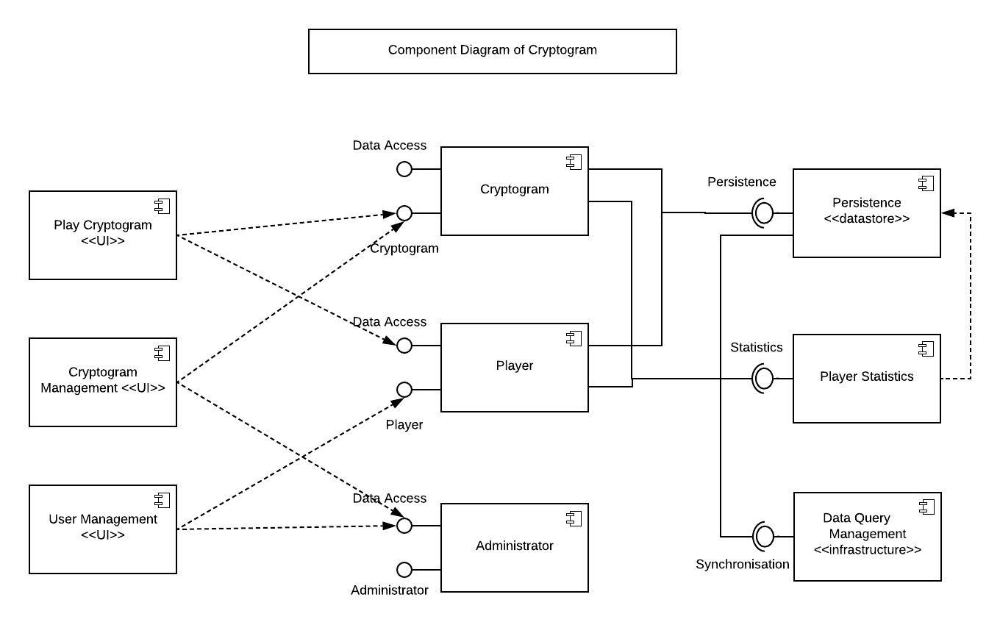

# Design Document

**Author**: Team 14

**Version**: 1.1

| Version | Time | Description |
| --------| -----| ------------|
| 1.2 | 03/06/2019 | database updated in System Environment section|
| 1.1 | 03/01/2019 | class diagram modified |
| 1.0 | 02/22/2019 | full doc submitted in D2 

## 1. Design Considerations

### 1.1 Assumptions

* The user interacts with the application via an Android device with of minimum operating system requirement **(Android 6.0)**
* Authentication is **not** available and unique username is used for the authorization.
* There will be **only one administrator** and the administrator can create/add multiple players and cryptograms but no other user with administrative priviledges can be created.
* Players can play multiple cryptograms but **only one at a time**.
* Temporary game lost due to forced crash will **not** be recovered.
* Adminstrator access Player statistics via relationship with the Player entity.
* Any data presentation and persistence, datalist utility is will be performed at the database tier.
* There is a single system running the application.
* There is no limit to the amount of cryptograms that a player has outstanding. At any point, the player can return to the list of unsolved cryptograms to attempt another.
* Player statistics is sorted in descending order from highest to lowest scores.
* There is a boolean flag to track the logged on user.
* There is a separate Administrator view and Player view.

### 1.2 Constraints

* This application is only available on the Android operating system **(Android 6.0)**.  and cannot be operated on a MacOS and/or Windows based operating system. 
* The UI and cryptogram phases are only in **English** language. 
* Application may be constrained based on limited connection scenarios.
* **No filtering feature** is available.

### 1.3 System Environment

* This application will run only on Android based operating system **(Android 6.0)**. The hardware includes Android phones, tablets and Personal computers.
* The software is written in Java. The hardware supports Java 1.8 and above.  
* Any API, interface interaction with external system services will be developed in Java.  
* A database is required to store transactional player and cryptogram data. We are using Sugar ORM library to integrate the data and application into a SQLite Database.

## 2. Architectural Design
### 2.1 Component Diagram

Since we are developing an android app running on an android device or virtual android emulator with no extra components, there are no other extra components to be shown in the component diagram. The following diagram shows the breakdown of different components of the app that are used for running the application in the android device itself.  

### 2.2 Deployment Diagram

This is a basic android application and the deployment is straight-forward. The application code will reside on the device and deployed via a virtual device such as an android emulator. Therefore, a diagram was not deemed to be necessary.

## 3. Low-Level Design

### 3.1 Class Diagram

## 4. User Interface Design
  

- Left: Login screen for the user
- Center: Player Menu when  player logs in
- Right: Administrator Menu when administrator logs in

  

- Player UI
	- Left: When player selects **Choose Cryptogram**
	- Center: When player selects a cryptogram to solve
	- Right: Player Statistics view when player selects **View Player Statistics**

  

- Admin UI
	- Left: When admin selects **Create Cryptogram**
	- Center: When admin selects **Create Player**
	- Right: Admin Statistics view when admin selects **View Player Statistics**

## Note:

***Known Issues:***

**This is the Beta/initial version of the Cryptogame app. It includes functionalities such as, Login, Create Cryptogram, Create Player, View Player Statistics, Choose Cryptogram, Solve Cryptogram and Logout. The return to menu is accomplished using the android back button. The tests were done manually only due to the time constraint. All the tests performed are updated in the Test plan.**
	
