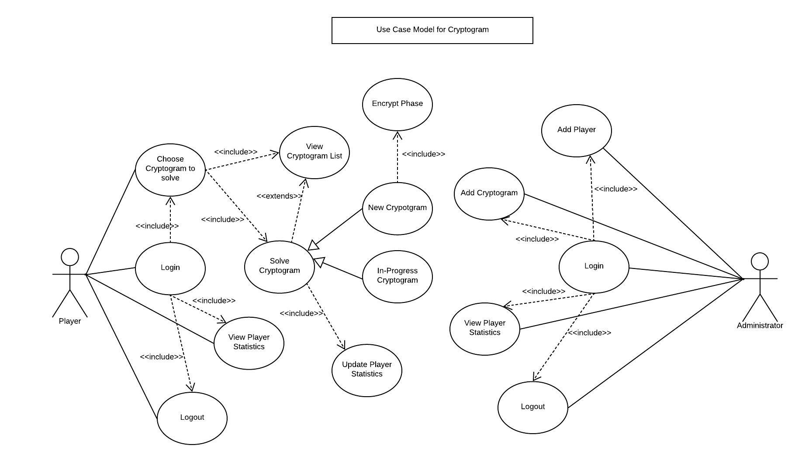

# Use Case Model

**Author**: Team 14

**Version**: 1.1

| Version | Time | Description |
| --------| -----| ------------|
| 1.2 | 03/06/2019 | review and edit |
| 1.1 | 03/01/2019 | user diagram modified as some implementations removed due to time constraint |
| 1.0 | 02/22/2019 | full doc submitted in D2 

## 1. Use Case Diagram


## 2. Use Case Descriptions


### Use cases common to both Administrator and Player:

**Login**
- *Requirements*: It allows the user either player or administrator to login the application.
- *Pre-conditions*: The user should install and open the app in an android device.
- *Post-conditions*: The user must be able to use the application and its features.
- *Scenario*: 
	- Normal(Correct Username): 
		The system prompts the user a field to enter Username and ***Login*** button.
		The user enters Username and presses ***Login*** button. The system validates the username and logs in the app.
		The user can use the features of the app.   
	- Exception(Incorrect Username): 

		After the user enters the Username and presses ***Login*** button, if the system cannot find the username in the database then it throws an error ```Incorrect Username```.
	- Exception(Blank Username): 
		The user doesn't enter Username and presses ***Login*** button then it throws an error ```Enter Username```.


**Logout**
- *Requirements*: It allows the user either player or administrator to logout of the application.
- *Pre-conditions*: The user must be logged in the app.
- *Post-conditions*: The user must not be able to use the application and be back to the Login screen.
- *Scenario*: 
	The user presses ***Logout*** button and the system exits from the app and brings the user to the **Login** page. 


**View Statistics**
- *Requirements*: It allows the user either player or administrator to view the player statistics of the players using the app.
- *Pre-conditions*: The user must be logged in the app.
- *Post-conditions*: The user should see the list of the player statistics on descending order.
- *Scenarios*: 
	- Scenario 1(Player View):
		After logging in, when the player selects **View Statistics** button, the system will generate the list of players with their first name and number of cryptograms won in descending order.
	- Scenario 2(Administrator View):
		After logging in, when the administrator selects **View Statistics** button, the system will generate the list of players with their first name, username, number of cryptograms won and number of cryptograms lost in descending order.


### Player Use cases:

**Choose Cryptogram to solve**
- *Requirements*: It allows the player to view the list of cryptograms available including both new **not started** and started **in-progress** cryptograms and choose from them to solve.
- *Pre-conditions*: The player should be logged in the app.
- *Post-conditions*: The player must be able to view cryptogram list and solve one of them.
- *Scenario*: 
	- Scenario 1(View List):

		After logging in, the player presses **Choose cryptogram** to solve, the system generates a list of cryptograms that are marked either **not started** or **in-progress** option. The player can check the list and return back to the menu.


	- Scenario 2(View List and Solve Cryptogram):
		- Normal(Solve New Cryptogram):
			After logging in, the player presses **Choose cryptogram** to solve, the system generates a list of cryptograms that are marked either **not started** or **in-progress**. The user selects a New Cryptogram to solve.

			The **Solve New Cryptogram** use case uses **Encrypt Phase** to generate an encrypted phrase and blank field for solution along with ***Submit Answer*** ,***View Potential Solution*** , ***Reset*** options.
			If the player provides a solution and presses ***Submit Answer*** button, the system checks the input solution with the actual solution and if correct displays ``Congratulations!! You won!!`` , updates the **Player Statistics** and returns to the cryptogram list with removing the solved cryptogram from the list.
			If the player provides a solution and presses ,***View Potential Solution***  button, the system matches the letters assigned by the player and displays the potential solution.
			If the player presses ***Reset*** button, the system clears the solution provided by the user. 
			If the player presses *back* option, them the system saves the existing state of the solution string and no. of incorrect attempts and returns the players to cryptogram list marking the cryptogram as **in-progress**.
		
		- Alternate(Solve in-progress Cryptogram):
			The alternate option for the player is to select the **in-progress** from the list i.e., **Solve in-progress cryptogram**. The system restores the previous state of the cryptogram and allows user to continue the game along with ***Submit Answer*** ,***View Potential Solution*** , ***Reset*** options and the process continues same as the normal solving new cryptogram use case.


		- Exception 1(Wrong solution):
			The exception case arises when the player submits the solution and the system finds that the solution doesn't match with the actual solution of the cryptogram. In this case, the system displays message ```Sorry! Wrong answer! Try Again!``` and returns to the cryptogram list reducing the incorrect the solution attempts by 1.

		- Exception 2(Lost game):
			In exception 1, when the solution doesn't match and the number of incorrect solution attempts is **zero (0)** then, the system displays ```Sorry! Wrong answer! No more attempts remaining! You lost the game!``` , marks the game as completed removing it from the cryptogram list, updates ***Player Statistics*** and returns the player back to the list.


### Administrator Use cases: 

**Add Player**
- *Requirements*: It allows the administrator to add a player in the application.
- *Pre-conditions*: The administrator must be logged in the app.
- *Post-conditions*: The player with the provided information must be added in the database and the player must be able to use the application and its features.
- *Scenario*: 
	- Normal(Unique Username):

		After logging in, the administrator selects the **Add Player** button and the system displays empty fields for first name, last name, username and difficulty category dropdown with *Easy* , *Normal* and *Hard* categories along with ***Add Player*** , ***Reset** options.
		The administrator presses ***Add Player*** button after entering the values in the fields. The system checks if the user name is unique and if unique, adds the player in the application, displays message ``New Player Added.`` , updates in database and returns the administrator to the **Add Player** page.
		If the adminsitrator presses ***Reset*** button, the system clears all the fields.  
		If the administrator presses *back* option, the system discards the player information and returns the administrator to the **Add Player** page.


	- Exception(Invalid Username):
		After entering the player information and pressing ***Add Player*** button, if the username is not unique, the system throws an error ```Username Invalid!! Please enter unique Username.``` and returns to the field of *Username*.
	
**Add Cryptogram**
- *Requirements*: It allows the administrator to add a cryptogram in the application.
- *Pre-conditions*: The administrator must be logged in the app.
- *Post-conditions*: The cryptogram with the provided information must be added in the database and the cryptogram must be available in the application to be solved by the players.
- *Scenario*: 
	- Normal(Unique Cryptogram name):

		After logging in, the administrator selects the **Add Cryptogram** button and the system displays empty fields for Cryptogram name, solution phrase (unencoded), and number for incorrect solution attempts for difficulty categories *Easy* , *Normal* and *Hard* categories along with ***Add Cryptogram*** , ***Reset*** options.
		The administrator presses ***Add Cryptogram*** button after entering the values in the fields. The system checks if the Cryptogram name is unique and if unique, adds it in the application, displays message ``New Cryptogram Added.`` , updates in database and returns the administrator to the **Add Cryptogram** page. 
		If the adminsitrator presses ***Reset*** button, the system clears all the fields.  
		If the administrator presses *back* option, the system discards the cryptogram information and returns the administrator to the **Add Cryptogram** page.


	- Exception(Invalid Username)
		After entering the cryptogram information and pressing ***Add Cryptogram*** button, if the cryptogram name is not unique, the system throws an error ```Cryptogram name Invalid!! Please enter unique name.``` and returns to the field of *Cryptogram name*.


