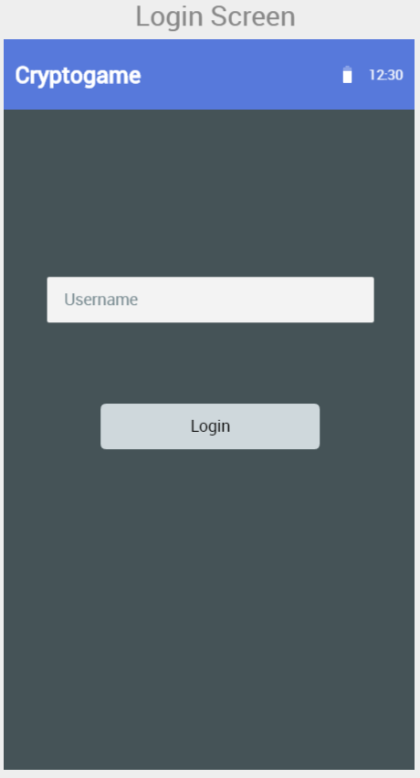
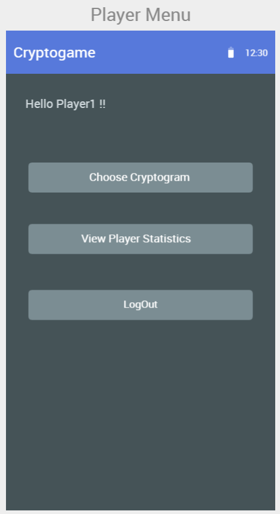
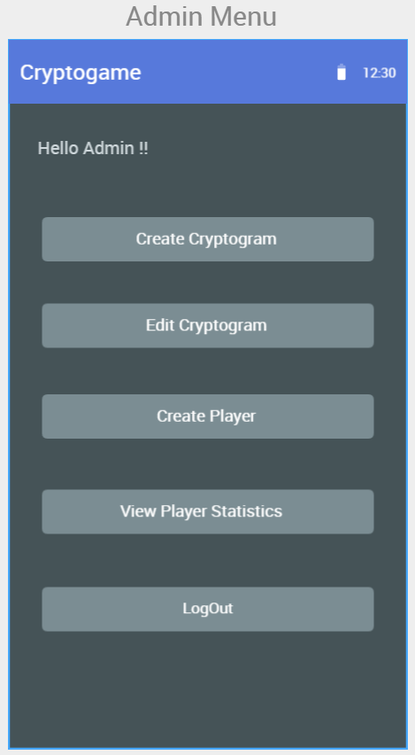
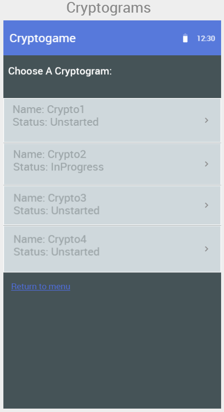
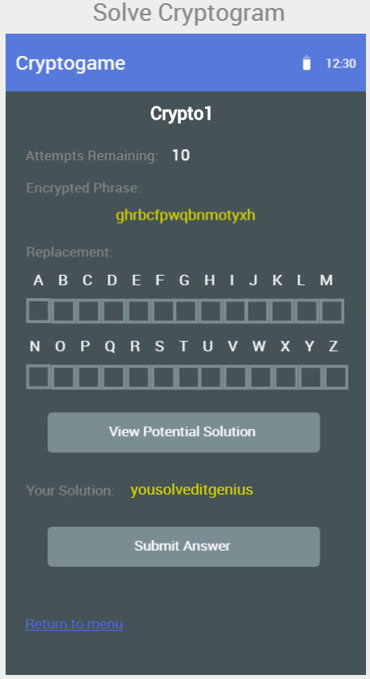
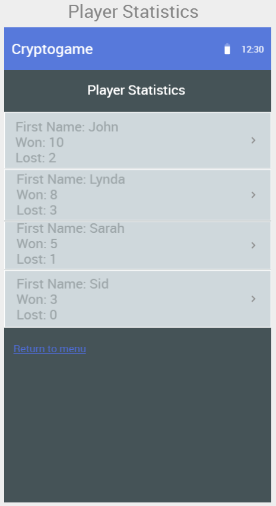
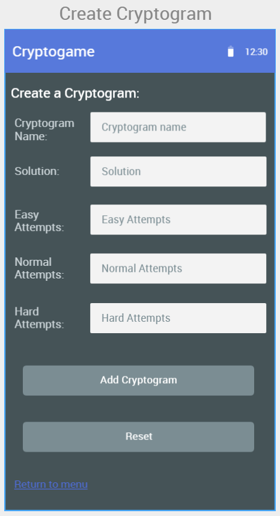
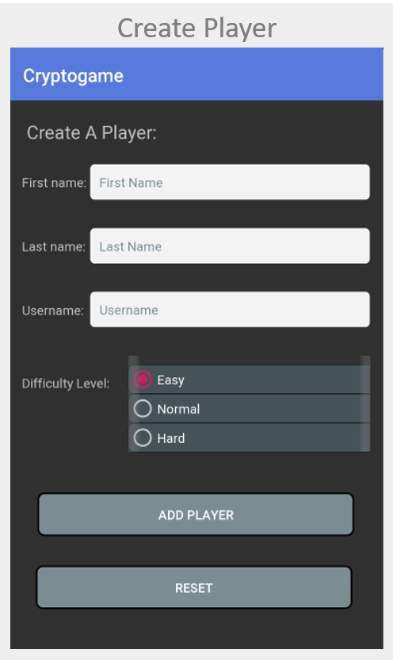
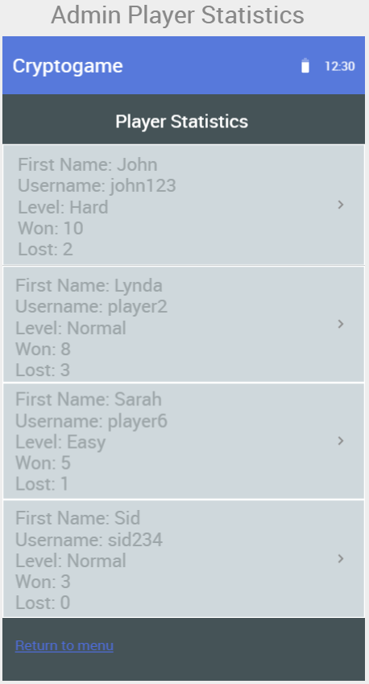

# Android Applications

## 1. Cryptogame
  Cryptogame is android application cryptogram puzzle game that uses simple substitution cipher to encrypt the letters of a short sentence. The player has to decode the encrypted sentence and reveal the original one. 
 
## 2. User Interface
  

- Left: Login screen for the user
- Center: Player Menu when  player logs in
- Right: Administrator Menu when administrator logs in

  

- Player UI
	- Left: When player selects **Choose Cryptogram**
	- Center: When player selects a cryptogram to solve
	- Right: Player Statistics view when player selects **View Player Statistics**

  

- Admin UI
	- Left: When admin selects **Create Cryptogram**
	- Center: When admin selects **Create Player**
	- Right: Admin Statistics view when admin selects **View Player Statistics**

